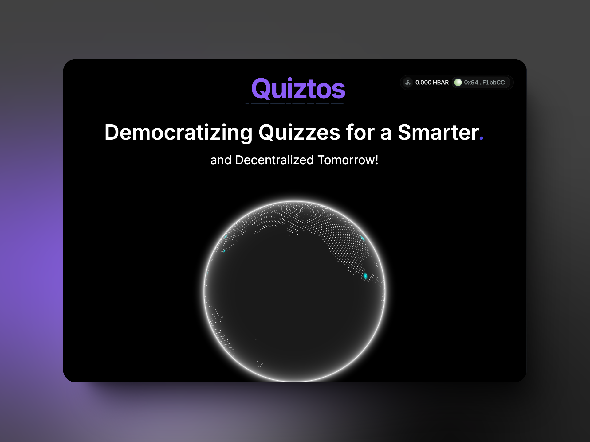

# Quiztos

[](https://nextjs.org)
[](https://opensource.org/licenses/MIT)
[](https://makeapullrequest.com)

Quiztos is a web3 based decentralized learning platform that provides a platform for users to learn and grow their knowledge through interactive quizzes. It uses AI to create personalized quizzes, adapts to the user's learning style, and provides real-time feedback and rewards.



## 📑 Table of Contents

- [Quiztos](#quiztos)
  - [📑 Table of Contents](#-table-of-contents)
  - [Features](#features)
  - [Getting Started](#getting-started)
  - [Team](#team)

## Features

- **Live Quizzes**

  - Interactive quizzes for learning
  - Personalized quizzes based on user's learning style
  - Real-time feedback and rewards

- **AI-Powered Learning**

  - AI-powered quizzes adapt to user's knowledge level
  - AI-powered quizzes provide instant feedback

- **Blockchain Integration**

  - Blockchain integration for secure and transparent quiz validation
  - Blockchain integration for rewards distribution

- **User-Friendly Interface**

  - User-friendly interface for easy navigation
  - User-friendly interface for easy access to quizzes

## Getting Started

1. **Clone the repository**

```bash
git clone https://github.com/ChiragAgg5k/quiztos
cd prabhawatt
```

2. **Install dependencies**

```bash
npm install
# or
pnpm install
# or
yarn install
```

3. **Set up environment variables**

```bash
GROQ_API_KEY=your-api-key
```

1. **Start the development server**

```bash
npm run dev
# or
pnpm dev
# or
yarn dev
```

Visit `http://localhost:3000` to see the application running.

## Team

The project is made during the `Dappathon` hackathon organized by the Indian Blockchain Fraternity club of Bennett University. The team consists of:

- [Rachit Khurana](https://github.com/notnotrachit)
- [Rakesh Sharma](https://github.com/aka-Rakesh)
- [Chirag Aggarwal](https://github.com/ChiragAgg5k)
